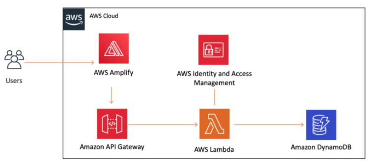

# terraform-basic-web-app
This repository is reference from [Build a Basic Web Application](https://aws.amazon.com/getting-started/hands-on/build-web-app-s3-lambda-api-gateway-dynamodb/) lab on AWS website.

## Todo list
- [x] Generate providers for all child environment folder with terragrunt.
- [ ] Generate backends for all child environment folder with terragrunt.
- [x] aws_amplify_app module
## Architecture
